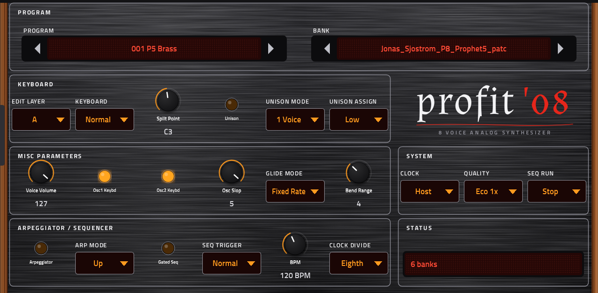

# Profit-08

An eight-voice, two-layer analog-style synthesizer for Akai MPC OS standalone devices (Force, MPC Live / One / X / Key), built as a native VST2
instrument. It plays the way the Prophet '08 does: two analog-style oscillators per voice with hard sync, a 2/4-pole resonant lowpass, three envelopes, four
LFOs, four mod slots and controller routes, a 4 x 16 gated sequencer and an arpeggiator, layers A and B combined as stacks and splits. Its program is the
instrument's own 384 bytes, so its program and bank SysEx dumps (including the factory banks) load unchanged.

*Profit-08 is an independent project, not affiliated with or endorsed by Dave Smith Instruments or Sequential. The name is a pun on the instrument it is modelled on.*

**Status: development build** (docs/STATUS.md): engine and tests offline, no skin yet, not tested on a device.

## Preset banks
The plugin makes a folder called `Preset_Banks` inside its own folder on first load. Put `.syx` files there (a folder named `Preset Banks` is read too) (program dumps or bank dumps from the instrument,
including the factory banks `Prophet_08_Programs_v1.0.syx`, which DSI publishes). Each bank in a file becomes a bank on the program page, named after the file.
No factory programs are shipped.

## How it was derived
The instrument's two OS updates (main, voice) were decoded offline with `tools/fw/`; they hold the unison detune table and a time table, not the factory
sounds or waves, and the analog sound is a model (`analog/`, shared with Morpho-PE and Sturm). See docs/FIRMWARE.md for what is exact, fitted and assumed.

## Building and testing
`tools/make_layout.sh` regenerates the parameter tables; `../mpc-vst-plugins/tools/test_port.sh vst/vst.json` is the host test;
`gcc -O2 -Isrc -Ianalog -I../mpc-vst-plugins/wrapper test/test_engine.c src/engine.c src/curves.c src/syx.c -lm && ./a.out DIR` runs the engine test
(DIR holds a `Preset_Banks` folder with your own `.syx` files).

## Credits
The wordmark's letter outlines come from the font Almendra (SIL Open Font License 1.1, Ana Sanfelippo, via Google Fonts), converted to paths by `tools/make_wordmark.py`.
